# Gallery

This gallery collects both end-to-end real-data workflows and style-system showcases for `investlabr`.

The goal is to keep [README.md](../../README.md) concise while maintaining a growing library of reproducible research workflows.

For navigation and maintenance, see:

- [GALLERY_INDEX.md](GALLERY_INDEX.md) for category mapping and package-boundary notes.
- [PROMOTION_BACKLOG.md](PROMOTION_BACKLOG.md) for reusable patterns that may later move into `investlabr`, `investdatar`, or `strategyr`.
- [_template-gallery-script.R](_template-gallery-script.R) for a starter structure for new daily-analysis examples.

## Conventions

- `investdatar` handles syncing and local access.
- `investlabr` handles transformation, comparison, and visualization.
- Examples are written as executable scripts for interactive use.
- Examples assume you already have the required data source credentials and local storage configured for `investdatar`.
- Keep local paths, one-off ticker choices, and narrative-specific labels inside gallery scripts rather than package functions.
- Promote repeated transformation, diagnostics, or visualization patterns into the appropriate package once the API is stable.

## Style and context showcases

- `viz-style-gallery.R`
  Renders the same multi-series chart across all named visualization styles.
- `viz-context-gallery.R`
  Renders the same chart across `report`, `slide`, and `dashboard` contexts.

### Style samples

`research_note`

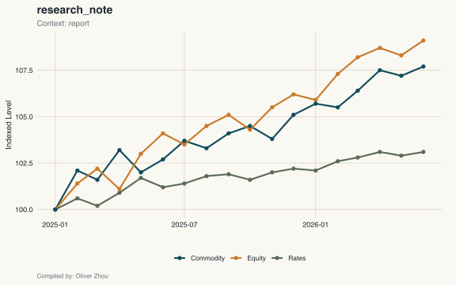

`macro_classic`

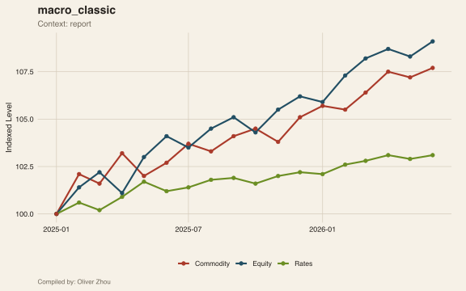

`terminal_risk`

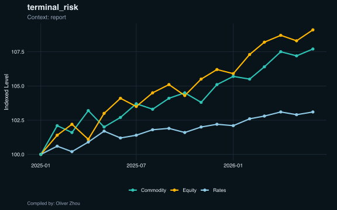

`cross_asset_color`

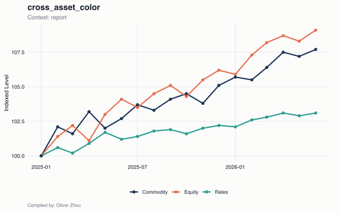

`minimal_print`


`strategy_explain`

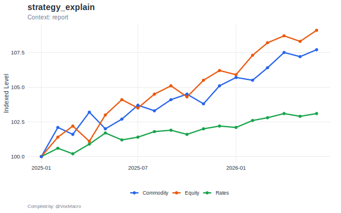

`presentation_bold`

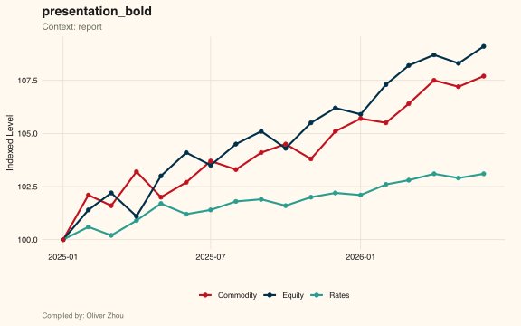

`briefing_serif`

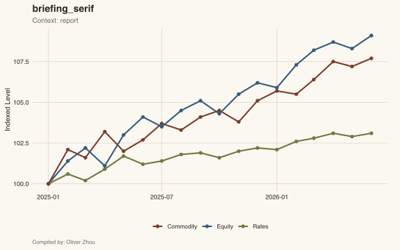

`institutional_blue`

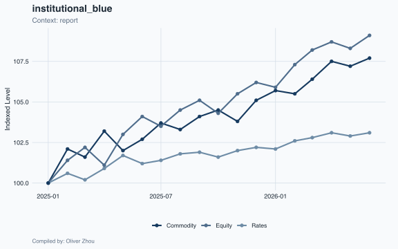

`policy_memo`

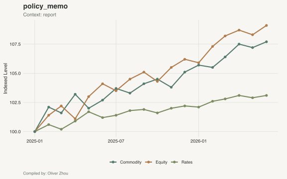

`desk_monitor`

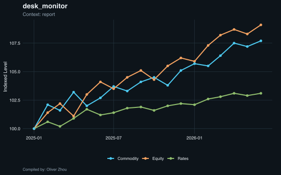

`client_slide`

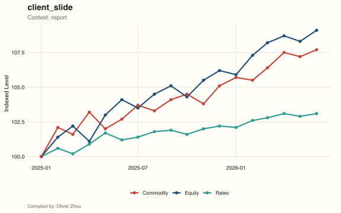

`newswire_print`

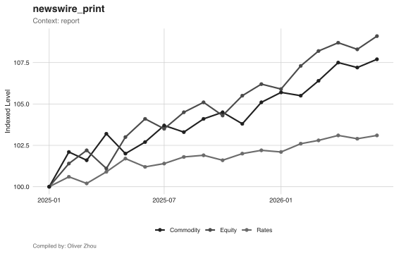

### Context samples

`report`

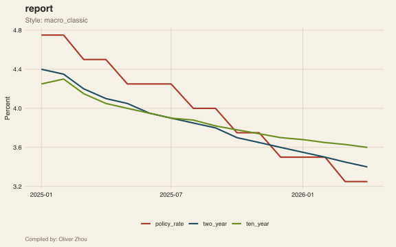

`slide`

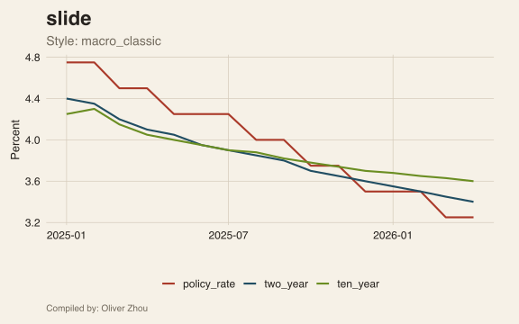

`dashboard`

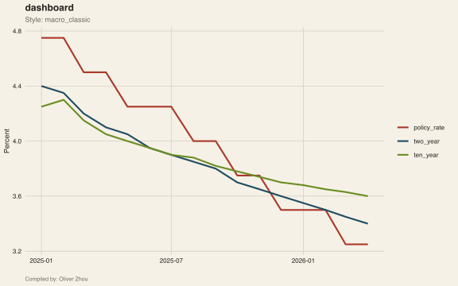

## Real-data workflows

- `real-data-fred-yield-curve.R`
  FRED Treasury series synced through `investdatar`, then plotted as a yield-curve comparison in `investlabr`.
- `real-data-fred-rate-shock-persistence-board.R`
  FRED 10-year Treasury data used to compare recent rate shocks, AR-style persistence envelopes, and realized post-shock paths.
- `real-data-fred-ci-lending-monitor.R`
  FRED C&I loan balances and selected SLOOS lending-condition series from the local `investdatar` cache rendered as a four-panel lending monitor.
- `real-data-treasury-nominal-real-weekly-board.R`
  Treasury local curve data from `investdatar::get_local_treasury_rates()` rendered as a two-panel board: nominal curve on the left and real curve on the right, each comparing the latest available date with the recent three-month high and low in the real 10-year yield.
- `real-data-yahoo-candles.R`
  Yahoo Finance S&P 500 OHLC data rendered as a candle chart with `strategyr`-derived pivot, cycle, Fibonacci, and EMA-confluence support/resistance levels, quarterly x-axis labels, and monthly guide lines.
- `real-data-yahoo-volatility-clustering-board.R`
  Yahoo Finance price history used as the real-data anchor for a four-panel board comparing actual returns with iid and GARCH-style benchmark behavior.
- `real-data-yahoo-forward-fan-from-recent-regime.R`
  Yahoo Finance index history used to calibrate a recent-regime forward fan with percentile bands, sample paths, and a terminal return distribution.
- `real-data-strategyr-donchian-backtest.R`
  Local Yahoo `DBC` data for 2014 run through `strategyr`'s 55-day Donchian breakout backtest with pre-window signal warmup, then visualized in `investlabr` with `eval_strat_plot_tsline_eq()`.
- `sim-strategy-explain-donchian-breakout.R`
  Simulated OHLC path explaining the Donchian breakout rule, prior-channel lines, breakout markers, and stateful long/short target exposure.
- `real-data-strategyr-macd-backtest.R`
  Local Yahoo ETF data run through two `strategyr` MACD examples: MACD cross on `XLU` in 2003 and MACD contrarian on `XLY` in 2012, each compared with its own buy-and-hold benchmark.
- `sim-strategy-explain-macd-cross-contrarian.R`
  Simulated OHLC path explaining how MACD cross and MACD contrarian convert MACD-spread signs into long/short target exposure.
- `real-data-strategyr-rsi-backtest.R`
  Local Yahoo `XLP` data for 2018 run through `strategyr`'s RSI mean-reversion strategy using `n = 21`, 25/75 thresholds, and a 45 exit level with pre-window signal warmup.
- `sim-strategy-explain-rsi-reversion.R`
  Simulated OHLC path explaining how classic RSI reversion converts oversold, overbought, and exit thresholds into target exposure.
- `real-data-strategyr-rsi-logr-backtest.R`
  Local Yahoo `SOXX` data for 2024 run through `strategyr`'s log-return RSI mean-reversion strategy using `h = 18`, 40/65 thresholds, and a 47.5 exit level with pre-window signal warmup.
- `sim-strategy-explain-rsi-logr-reversion.R`
  Simulated OHLC path explaining how log-return RSI reversion uses smoothed return momentum thresholds to set and exit target exposure.
- `real-data-strategyr-bollinger-backtest.R`
  Local Yahoo `CL=F` data for 2020 run through `strategyr`'s Bollinger mean-reversion strategy using `n = 15` and `k = 3.0`, with invalid oil futures OHLC bars filtered before signal construction.
- `sim-strategy-explain-bollinger-reversion.R`
  Simulated OHLC path explaining how Bollinger reversion converts lower-band, upper-band, and mid-band conditions into target exposure.
- `real-data-strategyr-vol-target-backtest.R`
  Local Yahoo index data run through `strategyr`'s volatility-targeted strategy backtest, then visualized in `investlabr`.
- `sim-strategy-explain-vol-target.R`
  Simulated close path explaining how volatility targeting separates trend direction from realized-volatility-based position sizing.
- `real-data-strategyr-ema-cross-backtest.R`
  Local Yahoo index data run through `strategyr`'s EMA-cross strategy backtest, then visualized in `investlabr`.
- `sim-strategy-explain-ema-cross.R`
  Simulated OHLC path explaining how EMA cross direction, low-ATR gating, freshness, and guard conditions create target exposure.
- `real-data-strategyr-atr-breakout-backtest.R`
  Local Yahoo index data run through `strategyr`'s ATR-breakout strategy backtest, then visualized in `investlabr`.
- `sim-strategy-explain-atr-breakout.R`
  Simulated OHLC path explaining how prior-ATR upside/downside breakouts change target exposure.
- `real-data-strategyr-trend-pullback-backtest.R`
  Local Yahoo index data run through `strategyr`'s trend-pullback strategy backtest, then visualized in `investlabr`.
- `sim-strategy-explain-trend-pullback.R`
  Simulated OHLC path explaining how EMA trend direction and RSI pullback thresholds combine into target exposure.
- `real-data-strategyr-ladder-bounce-backtest.R`
  Local Yahoo index data run through `strategyr`'s ladder-bounce strategy backtest, then visualized in `investlabr`.
- `real-data-strategyr-ladder-breakout-backtest.R`
  Local Yahoo index data run through `strategyr`'s ladder-breakout strategy backtest, then visualized in `investlabr`.
- `sim-strategy-explain-ladder-bounce-breakout.R`
  Simulated ladder-index path explaining the difference between mean-reversion ladder bounce and continuation ladder breakout.
- `real-data-strategyr-relative-strength-backtest.R`
  Local Yahoo ETF data run through `strategyr`'s relative-strength strategy using IEFA versus IVV, then visualized in `investlabr`.
- `sim-strategy-explain-relative-strength.R`
  Simulated traded-versus-benchmark path explaining how rolling relative strength sets long/short exposure.
- `real-data-strategyr-ratio-revert-backtest.R`
  Local Yahoo ETF data run through `strategyr`'s ratio-reversion strategy using SPY versus IVV, then visualized in `investlabr`.
- `real-data-strategyr-pair-spread-revert-backtest.R`
  Local Yahoo ETF data run through `strategyr`'s pair-spread reversion strategy using HYG versus LQD, then visualized in `investlabr`.
- `sim-strategy-explain-pair-ratio-reversion.R`
  Simulated pair path explaining how pair-spread and price-ratio z-score extremes create mean-reversion exposure.
- `real-data-strategyr-curve-steepener-backtest.R`
  Local Treasury curve data from `investdatar` drives lagged direct and contrarian `strategyr` curve-steepener signals, then a synthetic SHY/TLT Yahoo ETF ratio proxy is backtested and visualized in `investlabr`.
- `sim-strategy-explain-curve-steepener.R`
  Simulated yield-curve slope path explaining direct and contrarian curve-steepener target exposure.
- `real-data-yahoo-cross-asset-event-board.R`
  Cross-asset Yahoo Finance event study with four panels: equity, bond, FX, and commodity.
- `real-data-ishare-portfolio-mix.R`
  Four-panel portfolio-mix workflow using iShares ETF NAV history and FRED `DGS10` for a tangency line against the efficient frontier.
- `real-data-ishare-opportunity-set-board.R`
  Cross-sectional iShares opportunity-set board with a broader ETF universe, an annualized risk/return scatter, and an embedded summary table.
- `real-data-fred-risk-dashboard.R`
  Multi-panel risk dashboard using FRED series for VIX, EPU, and EMU, plus a daily VIX versus EPU comparison.
- `real-data-fred-policy-liquidity-dashboard.R`
  Policy rates, target band, Fed balance sheet, and reserve balances from FRED.
- `real-data-fred-curve-real-yield-dashboard.R`
  Curve spreads and real-yield comparisons from FRED.
- `real-data-fred-risk-appetite-dashboard.R`
  Equities, VIX, and credit spread dashboard from FRED.
- `real-data-fred-inflation-labor-dashboard.R`
  Inflation expectations and labor-market dashboard from FRED.
- `real-data-fred-liquidity-tightness-dashboard.R`
  Corridor-spread dashboard focused on reserve tightness, floor binding, bill scarcity, and a simple liquidity regime map.
- `real-data-fred-trade-conflict-overlay.R`
  Event-overlay chart for EFFR with shaded US trade-conflict episodes and callout labels.
- `real-data-fred-fomc-plumbing-board.R`
  FOMC implementation-plumbing board focused on IORB spreads, reserve mechanics, TGA swings, repo and ON RRP usage, and balance-sheet footprint.
- `real-data-fred-balance-sheet-mirror-board.R`
  Federal Reserve balance-sheet mirror board focused on weekly asset and liability stocks plus cumulative recent changes.
- `real-data-macro-factor-heatmap.R`
  Cross-sectional stock heatmap of full-sample macro-factor sensitivities using local Yahoo prices and FRED factors.
- `real-data-treasury-curve-decomposition-board.R`
  Treasury-source nominal, real, and breakeven curve board with a simple change decomposition across two dates.
  This remains a direct Treasury XML example because it focuses on a source-specific decomposition board; for a local-data Treasury workflow through `investdatar`, use `real-data-treasury-nominal-real-weekly-board.R`.
- `sim-forward-guidance-vs-warsh-regime.R`
  Stylized structural-break simulation comparing a slow forward-guidance regime with a faster repricing regime.
- `sim-digital-option-settlement-mismatch-board.R`
  Stylized payoff board for a prediction-market breakout leg plus short-straddle option leg, emphasizing same-settlement pricing assumptions, settlement mismatch, and bridge risk.

## Usage

Run an example interactively from the package root:

```r
source("inst/gallery/viz-style-gallery.R")
source("inst/gallery/viz-context-gallery.R")
source("inst/gallery/real-data-fred-yield-curve.R")
source("inst/gallery/real-data-fred-rate-shock-persistence-board.R")
source("inst/gallery/real-data-fred-ci-lending-monitor.R")
source("inst/gallery/real-data-treasury-nominal-real-weekly-board.R")
source("inst/gallery/real-data-yahoo-candles.R")
source("inst/gallery/real-data-yahoo-volatility-clustering-board.R")
source("inst/gallery/real-data-yahoo-forward-fan-from-recent-regime.R")
source("inst/gallery/real-data-strategyr-donchian-backtest.R")
source("inst/gallery/sim-strategy-explain-donchian-breakout.R")
source("inst/gallery/real-data-strategyr-macd-backtest.R")
source("inst/gallery/sim-strategy-explain-macd-cross-contrarian.R")
source("inst/gallery/real-data-strategyr-rsi-backtest.R")
source("inst/gallery/sim-strategy-explain-rsi-reversion.R")
source("inst/gallery/real-data-strategyr-rsi-logr-backtest.R")
source("inst/gallery/sim-strategy-explain-rsi-logr-reversion.R")
source("inst/gallery/real-data-strategyr-bollinger-backtest.R")
source("inst/gallery/sim-strategy-explain-bollinger-reversion.R")
source("inst/gallery/real-data-strategyr-vol-target-backtest.R")
source("inst/gallery/sim-strategy-explain-vol-target.R")
source("inst/gallery/real-data-strategyr-ema-cross-backtest.R")
source("inst/gallery/sim-strategy-explain-ema-cross.R")
source("inst/gallery/real-data-strategyr-atr-breakout-backtest.R")
source("inst/gallery/sim-strategy-explain-atr-breakout.R")
source("inst/gallery/real-data-strategyr-trend-pullback-backtest.R")
source("inst/gallery/sim-strategy-explain-trend-pullback.R")
source("inst/gallery/real-data-strategyr-ladder-bounce-backtest.R")
source("inst/gallery/real-data-strategyr-ladder-breakout-backtest.R")
source("inst/gallery/sim-strategy-explain-ladder-bounce-breakout.R")
source("inst/gallery/real-data-strategyr-relative-strength-backtest.R")
source("inst/gallery/sim-strategy-explain-relative-strength.R")
source("inst/gallery/real-data-strategyr-ratio-revert-backtest.R")
source("inst/gallery/real-data-strategyr-pair-spread-revert-backtest.R")
source("inst/gallery/sim-strategy-explain-pair-ratio-reversion.R")
source("inst/gallery/real-data-strategyr-curve-steepener-backtest.R")
source("inst/gallery/sim-strategy-explain-curve-steepener.R")
source("inst/gallery/real-data-yahoo-cross-asset-event-board.R")
source("inst/gallery/real-data-ishare-portfolio-mix.R")
source("inst/gallery/real-data-ishare-opportunity-set-board.R")
source("inst/gallery/real-data-fred-risk-dashboard.R")
source("inst/gallery/real-data-fred-policy-liquidity-dashboard.R")
source("inst/gallery/real-data-fred-curve-real-yield-dashboard.R")
source("inst/gallery/real-data-fred-risk-appetite-dashboard.R")
source("inst/gallery/real-data-fred-inflation-labor-dashboard.R")
source("inst/gallery/real-data-fred-liquidity-tightness-dashboard.R")
source("inst/gallery/real-data-fred-trade-conflict-overlay.R")
source("inst/gallery/real-data-fred-fomc-plumbing-board.R")
source("inst/gallery/real-data-fred-balance-sheet-mirror-board.R")
source("inst/gallery/real-data-macro-factor-heatmap.R")
source("inst/gallery/real-data-treasury-curve-decomposition-board.R")
source("inst/gallery/sim-forward-guidance-vs-warsh-regime.R")
source("inst/gallery/sim-digital-option-settlement-mismatch-board.R")
```

These scripts are intended to be edited for your own dates, tickers, and event labels.
