# Gallery

This gallery collects both end-to-end real-data workflows and style-system showcases for `investlabr`.

The goal is to keep [README.md](../../README.md) concise while maintaining a growing library of reproducible research workflows.

For navigation and maintenance, see:

- [GALLERY_INDEX.md](GALLERY_INDEX.md) for category mapping and package-boundary notes.
- [PROMOTION_BACKLOG.md](PROMOTION_BACKLOG.md) for reusable patterns that may later move into `investlabr`, `investdatar`, or `strategyr`.
- [_template-gallery-script.R](_template-gallery-script.R) for a starter structure for new daily-analysis examples.
- [scripts/README.md](../../scripts/README.md) for local executable task nodes.
- [output/README.md](../../output/README.md) for generated publishing-output conventions.
- [PUBLISHING_CONTRACT.md](../../PUBLISHING_CONTRACT.md) for the consumer-neutral artifact boundary.

## Conventions

- `investdatar` handles syncing and local access.
- `investlabr` handles transformation, comparison, and visualization.
- Examples are written as executable scripts for interactive use.
- Examples assume you already have the required data source credentials and local storage configured for `investdatar`.
- Keep local paths, one-off ticker choices, and narrative-specific labels inside gallery scripts rather than package functions.
- Promote repeated transformation, diagnostics, or visualization patterns into the appropriate package once the API is stable.
- Keep only curated style/context previews in `assets/`; generated publishing files belong under the repository-level `output/` directory.
- Gallery examples are human-facing and sourceable. Machine-facing commands belong under `scripts/` and follow the executable-node contract documented there.

## Category Directories

- `macro-monitor/`: current-condition dashboards and recurring macro monitors.
- `macro-forecast/`: forward fans, scenario paths, risk scores, and regime probabilities.
- `rates/`: nominal, real, breakeven, and yield-curve research.
- `cross-asset/`: cross-asset comparisons, event studies, and factor exposures.
- `market-charts/`: candles, volatility diagnostics, and technical context.
- `portfolio-research/`: opportunity sets, efficient frontiers, and portfolio-mix studies.
- `strategy-evaluation/`: real-data `strategyr` backtests presented through `investlabr`.
- `strategy-explanation/`: simulated examples explaining strategy mechanics.
- `simulation/`: broader structural and payoff simulations.
- `visualization/`: style and output-context showcases.
- `_shared/`: lightweight data-access and external-package glue used only by examples.

## Style and context showcases

- `visualization/viz-style-gallery.R`
  Renders the same multi-series chart across all named visualization styles.
- `visualization/viz-context-gallery.R`
  Renders the same chart across `report`, `slide`, and `dashboard` contexts.

### Style samples

`research_note`

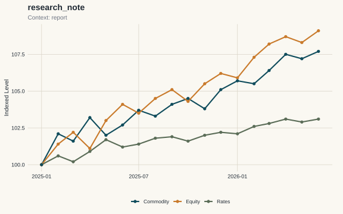

`macro_classic`

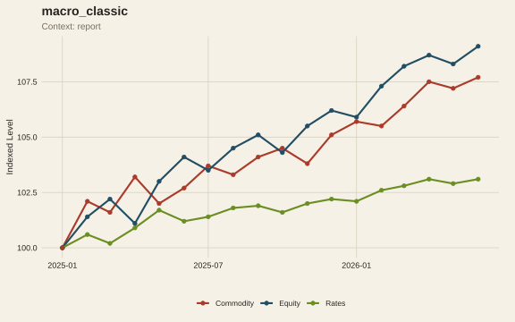

`terminal_risk`

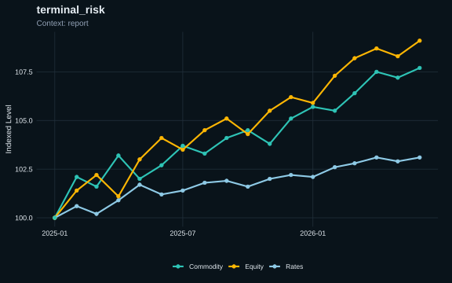

`cross_asset_color`

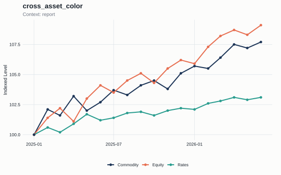

`minimal_print`

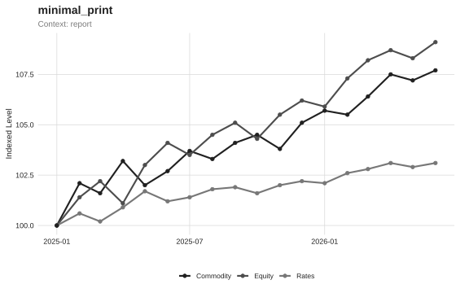

`strategy_explain`

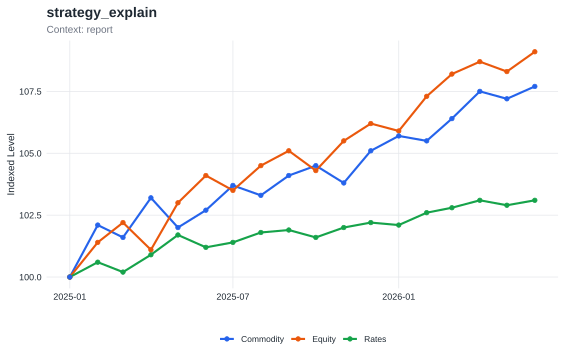

`presentation_bold`

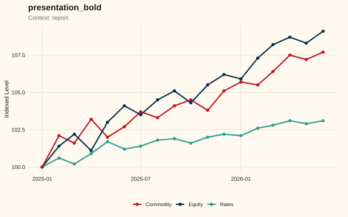

`briefing_serif`

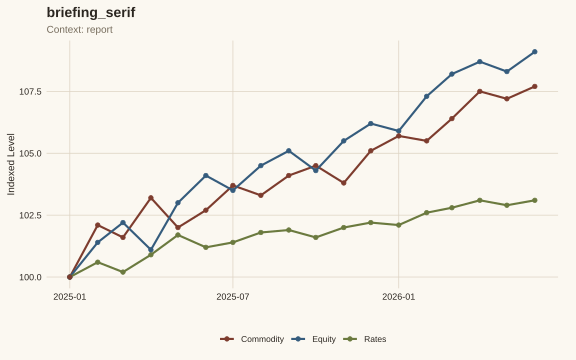

`institutional_blue`

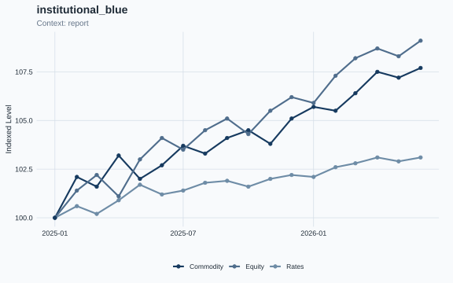

`policy_memo`

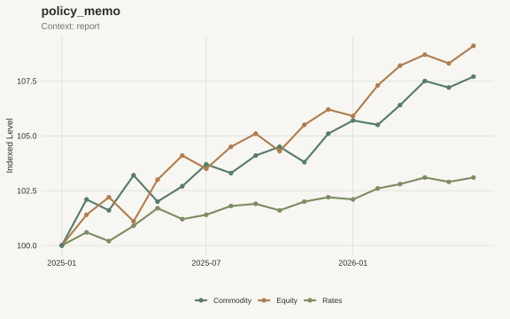

`desk_monitor`

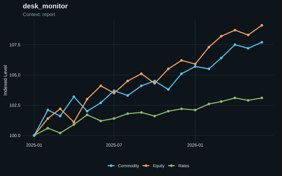

`client_slide`

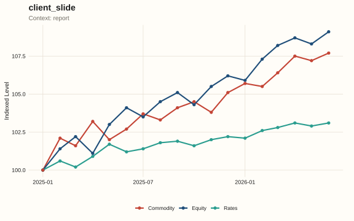

`newswire_print`

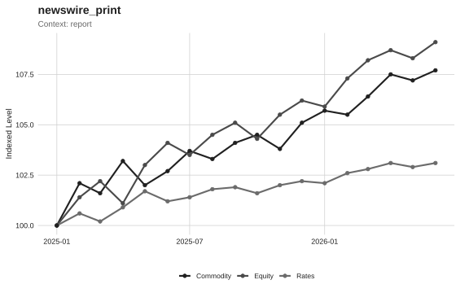

### Context samples

`report`

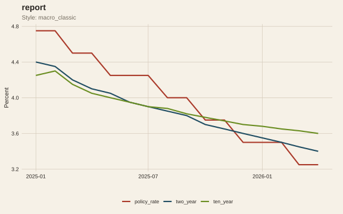

`slide`

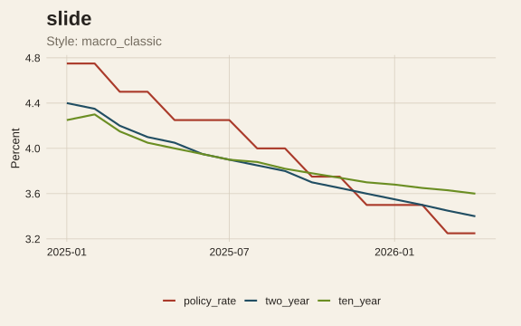

`dashboard`

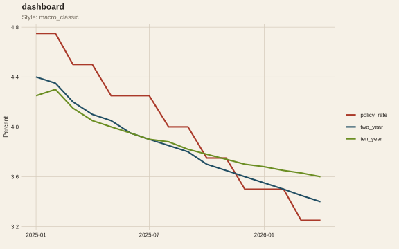

## Real-data workflows

- `rates/real-data-fred-yield-curve.R`
  FRED Treasury series synced through `investdatar`, then plotted as a yield-curve comparison in `investlabr`.
- `macro-forecast/real-data-fred-rate-shock-persistence-board.R`
  FRED 10-year Treasury data used to compare recent rate shocks, AR-style persistence envelopes, and realized post-shock paths.
- `macro-monitor/real-data-fred-ci-lending-monitor.R`
  FRED C&I loan balances and selected SLOOS lending-condition series from the local `investdatar` cache rendered as a four-panel lending monitor.
- `rates/real-data-treasury-nominal-real-weekly-board.R`
  Treasury local curve data from `investdatar::get_local_treasury_rates()` rendered as a two-panel board: nominal curve on the left and real curve on the right, each comparing the latest available date with the recent three-month high and low in the real 10-year yield.
- `market-charts/real-data-yahoo-candles.R`
  Yahoo Finance S&P 500 OHLC data rendered as a candle chart with `strategyr`-derived pivot, cycle, Fibonacci, and EMA-confluence support/resistance levels, quarterly x-axis labels, and monthly guide lines.
- `market-charts/real-data-yahoo-volatility-clustering-board.R`
  Yahoo Finance price history used as the real-data anchor for a four-panel board comparing actual returns with iid and GARCH-style benchmark behavior.
- `macro-forecast/real-data-yahoo-forward-fan-from-recent-regime.R`
  Yahoo Finance index history used to calibrate a recent-regime forward fan with percentile bands, sample paths, and a terminal return distribution.

### Macro data forecast workflows

The macro data forecast family is forward-looking research workflow code, not execution logic. `investdatar` owns data access and syncing; `investlabr` owns forecast preparation, scenario comparison, fan charts, probability/regime summaries, and briefing visuals; `strategyr` remains reserved for execution-oriented strategy logic.

Rates-path and policy-rate scripts:

- `macro-forecast/real-data-fred-rate-shock-persistence-board.R`
  Nominal-rate shock persistence board using local FRED Treasury yields.
- `macro-forecast/real-data-fred-yield-curve-forward-fan.R`
  Recent-regime percentile fans for 2Y, 10Y, and 10Y-2Y curve paths.
- `macro-forecast/real-data-fred-policy-rate-path-board.R`
  EFFR, SOFR, IORB, and target-rate scenario paths for policy-rate discussion.
- `macro-forecast/real-data-fred-real-yield-persistence-board.R`
  Real-yield and breakeven shock persistence paths after large changes.

Inflation, labor, and recession-risk scripts:

- `macro-forecast/real-data-fred-inflation-nowcast-band-board.R`
  Simple CPI nowcast bands from recent monthly inflation distributions.
- `macro-forecast/real-data-fred-labor-softening-probability-board.R`
  Bounded labor-softening risk score from unemployment, claims, and payroll momentum.
- `macro-forecast/real-data-fred-disinflation-vs-reacceleration-scenarios.R`
  Explicit CPI/core/wage scenario paths for disinflation versus reacceleration.
- `macro-forecast/real-data-fred-recession-probability-dashboard.R`
  Heuristic recession-risk dashboard from curve, labor, credit, and manufacturing indicators.
- `macro-forecast/real-data-fred-soft-landing-vs-hard-landing-board.R`
  Current macro state compared with soft-landing and hard-landing templates.
- `macro-forecast/real-data-fred-regime-transition-matrix-board.R`
  Simple macro-regime labels, transition matrix, and current-regime next-step probabilities.

Liquidity and balance-sheet scenario scripts:

- `macro-forecast/real-data-fred-liquidity-drain-forward-board.R`
  Accounting-style reserve-drain paths under TGA and ON RRP flow assumptions.
- `macro-forecast/real-data-fred-balance-sheet-runoff-scenarios.R`
  Fed balance-sheet runoff scenarios for total assets and selected components.
- `macro-forecast/real-data-fred-liquidity-tightness-risk-meter.R`
  Compact liquidity-tightness meter combining corridor spreads and reserve proxies.

Macro-conditional cross-asset scripts:

- `macro-forecast/real-data-yahoo-forward-fan-from-recent-regime.R`
  Recent-regime Yahoo price fan with percentile paths and terminal distribution.
- `macro-forecast/real-data-yahoo-macro-regime-conditional-fan-board.R`
  Cross-asset forward fans conditional on simple FRED macro-regime labels.
- `macro-forecast/real-data-yahoo-rate-shock-conditional-forward-returns.R`
  Cross-asset forward-return paths after large rate-shock events.
- `macro-forecast/real-data-yahoo-dollar-liquidity-spillover-board.R`
  Forward paths after dollar/liquidity tightening episodes.

- `strategy-evaluation/real-data-strategyr-donchian-backtest.R`
  Local Yahoo `DBC` data for 2014 run through `strategyr`'s 55-day Donchian breakout backtest with pre-window signal warmup, then visualized in `investlabr` with `eval_strat_plot_tsline_eq()`.
- `strategy-explanation/sim-strategy-explain-donchian-breakout.R`
  Simulated OHLC path explaining the Donchian breakout rule, prior-channel lines, breakout markers, and stateful long/short target exposure.
- `strategy-evaluation/real-data-strategyr-macd-backtest.R`
  Local Yahoo ETF data run through two `strategyr` MACD examples: MACD cross on `XLU` in 2003 and MACD contrarian on `XLY` in 2012, each compared with its own buy-and-hold benchmark.
- `strategy-explanation/sim-strategy-explain-macd-cross-contrarian.R`
  Simulated OHLC path explaining how MACD cross and MACD contrarian convert MACD-spread signs into long/short target exposure.
- `strategy-evaluation/real-data-strategyr-rsi-backtest.R`
  Local Yahoo `XLP` data for 2018 run through `strategyr`'s RSI mean-reversion strategy using `n = 21`, 25/75 thresholds, and a 45 exit level with pre-window signal warmup.
- `strategy-explanation/sim-strategy-explain-rsi-reversion.R`
  Simulated OHLC path explaining how classic RSI reversion converts oversold, overbought, and exit thresholds into target exposure.
- `strategy-evaluation/real-data-strategyr-rsi-logr-backtest.R`
  Local Yahoo `SOXX` data for 2024 run through `strategyr`'s log-return RSI mean-reversion strategy using `h = 18`, 40/65 thresholds, and a 47.5 exit level with pre-window signal warmup.
- `strategy-explanation/sim-strategy-explain-rsi-logr-reversion.R`
  Simulated OHLC path explaining how log-return RSI reversion uses smoothed return momentum thresholds to set and exit target exposure.
- `strategy-evaluation/real-data-strategyr-bollinger-backtest.R`
  Local Yahoo `CL=F` data for 2020 run through `strategyr`'s Bollinger mean-reversion strategy using `n = 15` and `k = 3.0`, with invalid oil futures OHLC bars filtered before signal construction.
- `strategy-explanation/sim-strategy-explain-bollinger-reversion.R`
  Simulated OHLC path explaining how Bollinger reversion converts lower-band, upper-band, and mid-band conditions into target exposure.
- `strategy-evaluation/real-data-strategyr-vol-target-backtest.R`
  Local Yahoo index data run through `strategyr`'s volatility-targeted strategy backtest, then visualized in `investlabr`.
- `strategy-explanation/sim-strategy-explain-vol-target.R`
  Simulated close path explaining how volatility targeting separates trend direction from realized-volatility-based position sizing.
- `strategy-evaluation/real-data-strategyr-ema-cross-backtest.R`
  Local Yahoo index data run through `strategyr`'s EMA-cross strategy backtest, then visualized in `investlabr`.
- `strategy-explanation/sim-strategy-explain-ema-cross.R`
  Simulated OHLC path explaining how EMA cross direction, low-ATR gating, freshness, and guard conditions create target exposure.
- `strategy-evaluation/real-data-strategyr-atr-breakout-backtest.R`
  Local Yahoo index data run through `strategyr`'s ATR-breakout strategy backtest, then visualized in `investlabr`.
- `strategy-explanation/sim-strategy-explain-atr-breakout.R`
  Simulated OHLC path explaining how prior-ATR upside/downside breakouts change target exposure.
- `strategy-evaluation/real-data-strategyr-trend-pullback-backtest.R`
  Local Yahoo index data run through `strategyr`'s trend-pullback strategy backtest, then visualized in `investlabr`.
- `strategy-explanation/sim-strategy-explain-trend-pullback.R`
  Simulated OHLC path explaining how EMA trend direction and RSI pullback thresholds combine into target exposure.
- `strategy-evaluation/real-data-strategyr-ladder-bounce-backtest.R`
  Local Yahoo index data run through `strategyr`'s ladder-bounce strategy backtest, then visualized in `investlabr`.
- `strategy-evaluation/real-data-strategyr-ladder-breakout-backtest.R`
  Local Yahoo index data run through `strategyr`'s ladder-breakout strategy backtest, then visualized in `investlabr`.
- `strategy-explanation/sim-strategy-explain-ladder-bounce-breakout.R`
  Simulated ladder-index path explaining the difference between mean-reversion ladder bounce and continuation ladder breakout.
- `strategy-evaluation/real-data-strategyr-relative-strength-backtest.R`
  Local Yahoo ETF data run through `strategyr`'s relative-strength strategy using IEFA versus IVV, then visualized in `investlabr`.
- `strategy-explanation/sim-strategy-explain-relative-strength.R`
  Simulated traded-versus-benchmark path explaining how rolling relative strength sets long/short exposure.
- `strategy-evaluation/real-data-strategyr-ratio-revert-backtest.R`
  Local Yahoo ETF data run through `strategyr`'s ratio-reversion strategy using SPY versus IVV, then visualized in `investlabr`.
- `strategy-evaluation/real-data-strategyr-pair-spread-revert-backtest.R`
  Local Yahoo ETF data run through `strategyr`'s pair-spread reversion strategy using HYG versus LQD, then visualized in `investlabr`.
- `strategy-explanation/sim-strategy-explain-pair-ratio-reversion.R`
  Simulated pair path explaining how pair-spread and price-ratio z-score extremes create mean-reversion exposure.
- `strategy-evaluation/real-data-strategyr-curve-steepener-backtest.R`
  Local Treasury curve data from `investdatar` drives lagged direct and contrarian `strategyr` curve-steepener signals, then a synthetic SHY/TLT Yahoo ETF ratio proxy is backtested and visualized in `investlabr`.
- `strategy-explanation/sim-strategy-explain-curve-steepener.R`
  Simulated yield-curve slope path explaining direct and contrarian curve-steepener target exposure.
- `cross-asset/real-data-yahoo-cross-asset-event-board.R`
  Cross-asset Yahoo Finance event study with four panels: equity, bond, FX, and commodity.
- `cross-asset/real-data-yahoo-us-sector-11-event-board.R`
  US sector ETF event board using local Yahoo data, indexed performance, multiple event markers, annual guide lines, and short end labels.
- `portfolio-research/real-data-ishare-portfolio-mix.R`
  Four-panel portfolio-mix workflow using iShares ETF NAV history and FRED `DGS10` for a tangency line against the efficient frontier.
- `portfolio-research/real-data-ishare-opportunity-set-board.R`
  Cross-sectional iShares opportunity-set board with a broader ETF universe, an annualized risk/return scatter, and an embedded summary table.
- `macro-monitor/real-data-fred-risk-dashboard.R`
  Multi-panel risk dashboard using FRED series for VIX, EPU, and EMU, plus a daily VIX versus EPU comparison.
- `macro-monitor/real-data-fred-policy-liquidity-dashboard.R`
  Policy rates, target band, Fed balance sheet, and reserve balances from FRED.
- `rates/real-data-fred-curve-real-yield-dashboard.R`
  Curve spreads and real-yield comparisons from FRED.
- `macro-monitor/real-data-fred-risk-appetite-dashboard.R`
  Equities, VIX, and credit spread dashboard from FRED.
- `macro-monitor/real-data-fred-inflation-labor-dashboard.R`
  Inflation expectations and labor-market dashboard from FRED.
- `macro-monitor/real-data-fred-liquidity-tightness-dashboard.R`
  Corridor-spread dashboard focused on reserve tightness, floor binding, bill scarcity, and a simple liquidity regime map.
- `cross-asset/real-data-fred-trade-conflict-overlay.R`
  Event-overlay chart for EFFR with shaded US trade-conflict episodes and callout labels.
- `macro-monitor/real-data-fred-fomc-plumbing-board.R`
  FOMC implementation-plumbing board focused on IORB spreads, reserve mechanics, TGA swings, repo and ON RRP usage, and balance-sheet footprint.
- `macro-monitor/real-data-fred-balance-sheet-mirror-board.R`
  Federal Reserve balance-sheet mirror board focused on weekly asset and liability stocks plus cumulative recent changes.
- `cross-asset/real-data-macro-factor-heatmap.R`
  Cross-sectional stock heatmap of full-sample macro-factor sensitivities using local Yahoo prices and FRED factors.
- `rates/real-data-treasury-curve-decomposition-board.R`
  Treasury-source nominal, real, and breakeven curve board with a simple change decomposition across two dates.
  This remains a direct Treasury XML example because it focuses on a source-specific decomposition board; for a local-data Treasury workflow through `investdatar`, use `rates/real-data-treasury-nominal-real-weekly-board.R`.
- `simulation/sim-forward-guidance-vs-warsh-regime.R`
  Stylized structural-break simulation comparing a slow forward-guidance regime with a faster repricing regime.
- `simulation/sim-digital-option-settlement-mismatch-board.R`
  Stylized payoff board for a prediction-market breakout leg plus short-straddle option leg, emphasizing same-settlement pricing assumptions, settlement mismatch, and bridge risk.

## Usage

Run an example interactively from the package root:

```r
source("inst/gallery/visualization/viz-style-gallery.R")
source("inst/gallery/visualization/viz-context-gallery.R")
source("inst/gallery/rates/real-data-fred-yield-curve.R")
source("inst/gallery/macro-forecast/real-data-fred-rate-shock-persistence-board.R")
source("inst/gallery/macro-monitor/real-data-fred-ci-lending-monitor.R")
source("inst/gallery/rates/real-data-treasury-nominal-real-weekly-board.R")
source("inst/gallery/market-charts/real-data-yahoo-candles.R")
source("inst/gallery/market-charts/real-data-yahoo-volatility-clustering-board.R")
source("inst/gallery/macro-forecast/real-data-yahoo-forward-fan-from-recent-regime.R")
source("inst/gallery/macro-forecast/real-data-fred-yield-curve-forward-fan.R")
source("inst/gallery/macro-forecast/real-data-fred-policy-rate-path-board.R")
source("inst/gallery/macro-forecast/real-data-fred-real-yield-persistence-board.R")
source("inst/gallery/macro-forecast/real-data-fred-inflation-nowcast-band-board.R")
source("inst/gallery/macro-forecast/real-data-fred-labor-softening-probability-board.R")
source("inst/gallery/macro-forecast/real-data-fred-disinflation-vs-reacceleration-scenarios.R")
source("inst/gallery/macro-forecast/real-data-fred-liquidity-drain-forward-board.R")
source("inst/gallery/macro-forecast/real-data-fred-balance-sheet-runoff-scenarios.R")
source("inst/gallery/macro-forecast/real-data-fred-liquidity-tightness-risk-meter.R")
source("inst/gallery/macro-forecast/real-data-yahoo-macro-regime-conditional-fan-board.R")
source("inst/gallery/macro-forecast/real-data-yahoo-rate-shock-conditional-forward-returns.R")
source("inst/gallery/macro-forecast/real-data-yahoo-dollar-liquidity-spillover-board.R")
source("inst/gallery/macro-forecast/real-data-fred-recession-probability-dashboard.R")
source("inst/gallery/macro-forecast/real-data-fred-soft-landing-vs-hard-landing-board.R")
source("inst/gallery/macro-forecast/real-data-fred-regime-transition-matrix-board.R")
source("inst/gallery/strategy-evaluation/real-data-strategyr-donchian-backtest.R")
source("inst/gallery/strategy-explanation/sim-strategy-explain-donchian-breakout.R")
source("inst/gallery/strategy-evaluation/real-data-strategyr-macd-backtest.R")
source("inst/gallery/strategy-explanation/sim-strategy-explain-macd-cross-contrarian.R")
source("inst/gallery/strategy-evaluation/real-data-strategyr-rsi-backtest.R")
source("inst/gallery/strategy-explanation/sim-strategy-explain-rsi-reversion.R")
source("inst/gallery/strategy-evaluation/real-data-strategyr-rsi-logr-backtest.R")
source("inst/gallery/strategy-explanation/sim-strategy-explain-rsi-logr-reversion.R")
source("inst/gallery/strategy-evaluation/real-data-strategyr-bollinger-backtest.R")
source("inst/gallery/strategy-explanation/sim-strategy-explain-bollinger-reversion.R")
source("inst/gallery/strategy-evaluation/real-data-strategyr-vol-target-backtest.R")
source("inst/gallery/strategy-explanation/sim-strategy-explain-vol-target.R")
source("inst/gallery/strategy-evaluation/real-data-strategyr-ema-cross-backtest.R")
source("inst/gallery/strategy-explanation/sim-strategy-explain-ema-cross.R")
source("inst/gallery/strategy-evaluation/real-data-strategyr-atr-breakout-backtest.R")
source("inst/gallery/strategy-explanation/sim-strategy-explain-atr-breakout.R")
source("inst/gallery/strategy-evaluation/real-data-strategyr-trend-pullback-backtest.R")
source("inst/gallery/strategy-explanation/sim-strategy-explain-trend-pullback.R")
source("inst/gallery/strategy-evaluation/real-data-strategyr-ladder-bounce-backtest.R")
source("inst/gallery/strategy-evaluation/real-data-strategyr-ladder-breakout-backtest.R")
source("inst/gallery/strategy-explanation/sim-strategy-explain-ladder-bounce-breakout.R")
source("inst/gallery/strategy-evaluation/real-data-strategyr-relative-strength-backtest.R")
source("inst/gallery/strategy-explanation/sim-strategy-explain-relative-strength.R")
source("inst/gallery/strategy-evaluation/real-data-strategyr-ratio-revert-backtest.R")
source("inst/gallery/strategy-evaluation/real-data-strategyr-pair-spread-revert-backtest.R")
source("inst/gallery/strategy-explanation/sim-strategy-explain-pair-ratio-reversion.R")
source("inst/gallery/strategy-evaluation/real-data-strategyr-curve-steepener-backtest.R")
source("inst/gallery/strategy-explanation/sim-strategy-explain-curve-steepener.R")
source("inst/gallery/cross-asset/real-data-yahoo-cross-asset-event-board.R")
source("inst/gallery/cross-asset/real-data-yahoo-us-sector-11-event-board.R")
source("inst/gallery/portfolio-research/real-data-ishare-portfolio-mix.R")
source("inst/gallery/portfolio-research/real-data-ishare-opportunity-set-board.R")
source("inst/gallery/macro-monitor/real-data-fred-risk-dashboard.R")
source("inst/gallery/macro-monitor/real-data-fred-policy-liquidity-dashboard.R")
source("inst/gallery/rates/real-data-fred-curve-real-yield-dashboard.R")
source("inst/gallery/macro-monitor/real-data-fred-risk-appetite-dashboard.R")
source("inst/gallery/macro-monitor/real-data-fred-inflation-labor-dashboard.R")
source("inst/gallery/macro-monitor/real-data-fred-liquidity-tightness-dashboard.R")
source("inst/gallery/cross-asset/real-data-fred-trade-conflict-overlay.R")
source("inst/gallery/macro-monitor/real-data-fred-fomc-plumbing-board.R")
source("inst/gallery/macro-monitor/real-data-fred-balance-sheet-mirror-board.R")
source("inst/gallery/cross-asset/real-data-macro-factor-heatmap.R")
source("inst/gallery/rates/real-data-treasury-curve-decomposition-board.R")
source("inst/gallery/simulation/sim-forward-guidance-vs-warsh-regime.R")
source("inst/gallery/simulation/sim-digital-option-settlement-mismatch-board.R")
```

These scripts are intended to be edited for your own dates, tickers, and event labels.
